> **Documento técnico.** La guía de producto e instalación rápida está en [README.md](README.md).

<div align="center">

# PlotBench

**Estación de trabajo *local-first* para inferencia LLM, recuperación vectorial e ilustración generativa anclada a relato.**

Arquitectura hexagonal · contrato de modelo por capas · historial arborescente · cola de GPU desacoplada

[](https://www.python.org/)
[](https://fastapi.tiangolo.com/)
[](https://react.dev/)
[](https://vite.dev/)
[](https://www.sqlalchemy.org/)
[](https://www.trychroma.com/)
[](#3-arquitectura)
[](#10-estrategia-de-testing)

</div>

| | |
|---|---|
| **Despliegue** | Proceso único (Uvicorn) + worker daemon de GPU + ChromaDB opcional en Docker |
| **Transporte de chat** | NDJSON (`application/x-ndjson`), una línea JSON por evento — sin SSE ni WebSocket |
| **Identidad de modelo** | `provider:model_id` resuelto por *factory*; contrato fusionado en tres capas |
| **Persistencia** | SQLite WAL + `busy_timeout` 30 s; vectores en ChromaDB; binarios en disco |
| **Límite de confianza** | El dominio no importa `httpx`, `chromadb` ni `sqlalchemy` |
| **Decisiones** | [`docs/ARCHITECTURE_2026-09-26.md`](docs/ARCHITECTURE_2026-09-26.md) — ADRs, fronteras y deuda |

---

## Índice

1. [Posicionamiento](#1-posicionamiento)
2. [Contexto del sistema](#2-contexto-del-sistema)
3. [Arquitectura](#3-arquitectura)
4. [Contextos delimitados](#4-contextos-delimitados)
5. [Flujos de ejecución](#5-flujos-de-ejecución)
6. [Consistencia y concurrencia](#6-consistencia-y-concurrencia)
7. [Modelo de seguridad](#7-modelo-de-seguridad)
8. [Modelo de datos](#8-modelo-de-datos)
9. [Superficie HTTP](#9-superficie-http)
10. [Estrategia de testing](#10-estrategia-de-testing)
11. [Frontend](#11-frontend)
12. [Puesta en marcha](#12-puesta-en-marcha)
13. [Configuración](#13-configuración)
14. [Operación](#14-operación)
15. [Patrones de diseño](#15-patrones-de-diseño)
16. [Convenciones](#16-convenciones)

---

## 1. Posicionamiento

`chatBot` no es un cliente de chat. Es una **plataforma de orquestación** que trata el modelo, las reglas de sistema, el historial y la GPU de imagen como recursos de primer nivel, con contratos explícitos entre ellos.

Tres decisiones de producto condicionan todo el diseño:

| Decisión | Consecuencia técnica |
|---|---|
| **Local-first, remoto opcional** | Ollama es el proveedor canónico. OpenAI, Mancer y Abliteration se habilitan por credencial, sin ramificar el dominio. |
| **El historial es un árbol, no una lista** | Cada mensaje tiene `parent_id`. Se bifurca (*fork*) desde cualquier nodo y se mantiene una hoja activa por conversación. |
| **Planificar ≠ generar** | Un LLM planifica escenas y las ancla a párrafos; un worker asíncrono las materializa en Forge Neo. Reintentar no replanifica. |

### Capacidades por dominio

| Dominio | Capacidad |
|---|---|
| **Inferencia** | Multi-proveedor (`LLMProvider` como `Protocol`); streaming token a token; *model contract* (params, capabilities, recipes, quirks); ventana de historial configurable. |
| **Conversación** | Árbol con *forks*, papelera (*soft-delete* + purga), título automático, *slash commands* (`/git`, `/files`, `/github`) como *hooks* de contexto. |
| **Reglas** | Biblioteca con *scopes* (`chat`, `planner`), *overrides* por turno, *seeding* idempotente desde `config/seed/`. |
| **RAG** | Colección `chat_history` en ChromaDB; embeddings Ollama u OpenAI; limpieza coordinada con el borrado SQL. |
| **Ilustración** | Planificador LLM → Strategy de anclaje → cola persistente con reintentos → Forge (`txt2img` / `img2img`) → ReActor opcional. |
| **Identidad** | Registro/login por cookie `HttpOnly`, roles (`is_admin`), *ownership* por fila, preferencias de UI persistidas en servidor. |
| **Workspace** | *Snapshots* del rig (modelo, reglas, params, panel de imagen) y presets del planificador, únicos por `(user_id, name)`. |

### Inventario del repositorio

| Artefacto | Magnitud |
|---|---|
| Backend (`app/`) | 99 módulos · 16 345 LOC |
| Frontend (`frontend/src/`) | 112 módulos JS/JSX |
| Routers FastAPI | 10, todos bajo `/api` |
| Tablas SQL | 10 (UUIDs, no enteros) |
| Proveedores LLM | 5 adaptadores + *factory* con caché por tipo |
| Suites | 97 pytest · 47 vitest |

---

## 2. Contexto del sistema

### 2.1 Contexto

El sistema corre en la estación del usuario. Los únicos actores externos son proveedores LLM remotos (opcionales) y, si se activa el RAG, un contenedor ChromaDB.

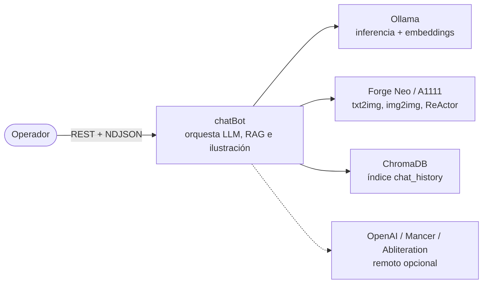

### 2.2 Contenedores

Un único proceso Python sirve la API y, en producción, la SPA estática. El worker de imágenes vive en un hilo *daemon* del mismo proceso. Vite solo existe en desarrollo.

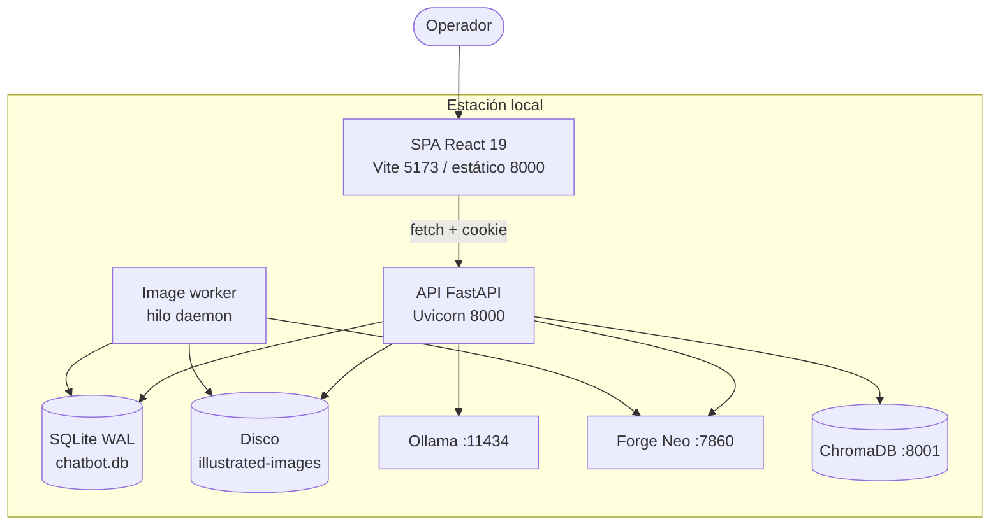

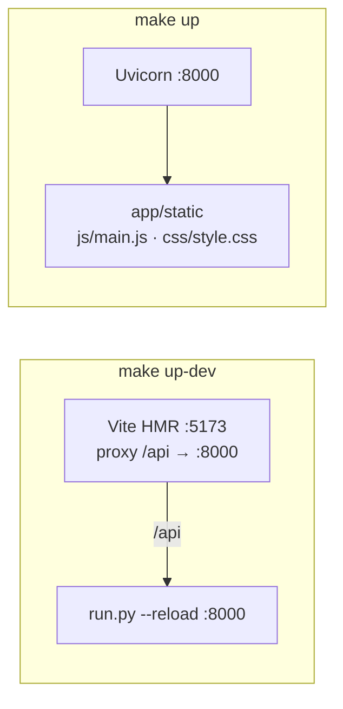

---

## 3. Arquitectura

### 3.1 Puertos y adaptadores

El hexágono es estricto: el dominio declara **puertos** (`typing.Protocol`) y la infraestructura aporta **adaptadores**. La composición ocurre en los routers (`Depends`) y en `ProviderFactory` (singleton por tipo de proveedor).

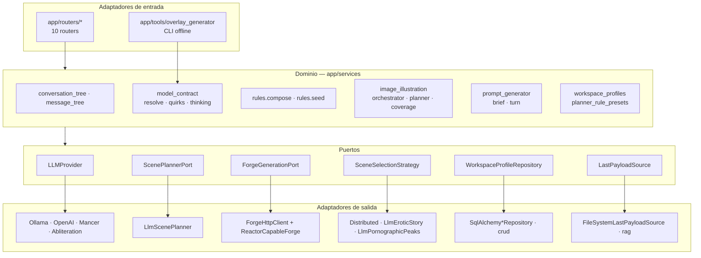

Dirección de dependencias invariante:

```
routers  →  services  →  ports  ←  adapters
```

Un servicio de dominio no instancia clientes HTTP ni abre sesiones SQLAlchemy. Eso permite sustituir Forge, Chroma o un proveedor LLM en test sin *monkeypatching* profundo.

### 3.2 Estructura

```
chatBot/
├── app/
│   ├── main.py                       # Composición: routers, estáticos, startup
│   ├── config.py                     # pydantic-settings + sync .env ↔ os.environ
│   ├── db.py                         # Engine, WAL, busy_timeout, ALTER idempotentes
│   ├── models.py · models_user.py    # 10 tablas, PK UUID
│   ├── schemas.py                    # DTOs Pydantic de la API
│   ├── crud.py                       # Acceso transaccional + claim de cola
│   ├── auth.py · ownership.py        # Cookie, PBKDF2, CurrentUser/AdminUser
│   ├── rag.py                        # Colección chat_history
│   ├── slash_commands.py             # Parser de /comando → contexto
│   ├── migrate_*.py                  # Migraciones de arranque, idempotentes
│   ├── routers/                      # Superficie HTTP
│   ├── providers/                    # Protocol + 5 adaptadores + factory
│   ├── services/
│   │   ├── conversation_tree.py      # Camino raíz → hoja activa
│   │   ├── message_tree.py           # Vista global roots/children
│   │   ├── model_contract/           # Fusión de contrato por modelo
│   │   ├── rules/                    # Composición y seeding
│   │   ├── image_illustration/       # Orquestador, planner, Forge, cola, ReActor
│   │   ├── prompt_generator/         # Agente entrevistador → prompt txt2img
│   │   ├── workspace_profiles/       # Snapshots del rig (hexágono completo)
│   │   └── planner_rule_presets/
│   └── tools/overlay_generator/      # Curado aditivo de overlays
├── frontend/src/{api,app,store,hooks,lib,ui}
├── config/{provider_params.json,model_overlays/,seed/}
├── tests/                            # 97 suites, incl. contratos de UI
├── scripts/dev_stack.sh
├── docker-compose.yml                # Solo ChromaDB
└── Makefile
```

---

## 4. Contextos delimitados

El monolito se parte en **contextos** con lenguaje ubícuo propio. Cruzar un contexto solo se hace por DTO o por un puerto.

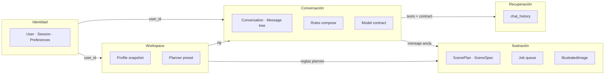

| Contexto | Agregado raíz | Invariante |
|---|---|---|
| **Identidad** | `User` | Sesión opaca de 32 bytes; preferencias JSON como documento, no columnas. |
| **Conversación** | `Conversation` | Existe exactamente un `active_leaf_message_id` que define el camino visible. |
| **Reglas** | `Rule` | `user_id IS NULL` = catálogo; builtins de solo lectura; *scope* discrimina chat vs planner. |
| **Contrato de modelo** | `ModelContract` (inmutable) | Fusión `base ⊂ live ⊂ overlay`; `empty_model_contract` es Null Object. |
| **Ilustración** | `ImageGenerationJob` | Un job es reintentable; el `ScenePlan` no se regenera al fallar Forge. |
| **Workspace** | `WorkspaceProfileRecord` | Unicidad `(user_id, name)`; el snapshot es opaco para el resto de contextos. |

---

## 5. Flujos de ejecución

### 5.1 Arranque

`startup` deja el sistema en estado consistente antes de aceptar tráfico. Las migraciones son `ALTER` idempotentes: fallar porque la columna ya existe es el camino feliz.

```mermaid
flowchart LR
    s(["startup"]) --> e["sync_env_to_dotenv"]
    e --> i["init_db<br/>create_all + ALTER"]
    i --> m1["migrate_model_info_rules"]
    m1 --> m2["migrate_conversation_rules_to_library"]
    m2 --> m3["migrate_fill_instruction_ids"]
    m3 --> sd["seed_builtin_rules"]
    sd --> bu["bootstrap_multi_user"]
    bu --> w["start_image_generation_worker"]
    w --> r["reset_stuck_image_generation_jobs"]
    r --> ready(["ready"])
```

El worker, al nacer, reencola jobs `generating` huérfanos de un proceso anterior. No se pierden generaciones a medias por un reinicio.

### 5.2 Turno de chat (NDJSON)

`POST /api/conversations/{id}/messages/stream` emite una línea JSON por evento: `token`, `status`, `llm_debug`, `done`, `error`. El transporte es depurable con `curl -N`.

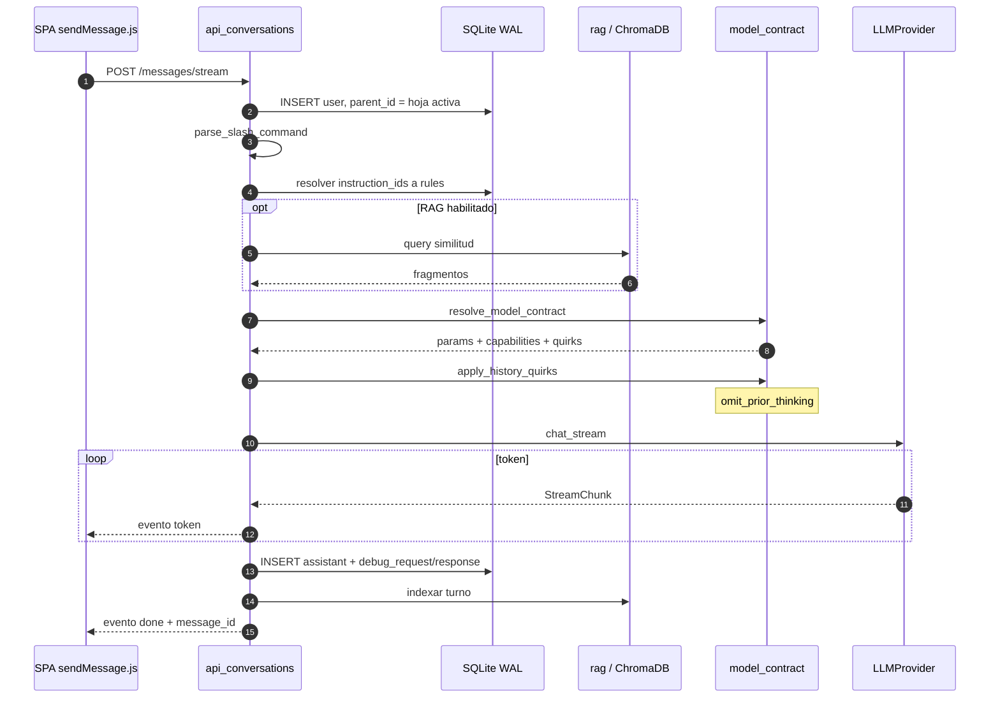

En cliente, `createStreamBuffer` acumula tokens y aplica **como máximo un `set` de store por frame** (`requestAnimationFrame`). Un stream de 80 tok/s no satura el commit de React.

### 5.3 Resolución del *model contract*

Los parámetros no están *hardcodeados*. Se fusionan tres capas, de menor a mayor prioridad. Un modelo nuevo funciona con el esquema base; el *overlay* solo documenta desviaciones.

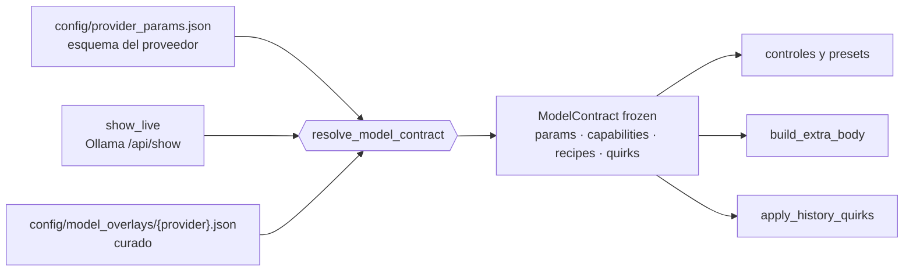

`overlay_generator` es una herramienta **offline y aditiva**: obtiene los **hechos fiables** del modelo (puerto `ModelFacts`), genera un *stub* y lo fusiona sin pisar lo curado a mano. Emite propuesta Markdown en `docs/research/overlay-proposals/` antes de persistir (`WRITE=1`). Los hechos dependen del proveedor vía la capacidad opcional `model_facts`: Ollama los deriva de `/api/show`; NaN, de su catálogo curado (`NAN_KNOWN_MODELS`), porque su API no expone un endpoint de detalle por modelo.

### 5.4 Pipeline de ilustración

Tres fases con fallos independientes. El caso frecuente —Forge sin VRAM— no tira el plan.

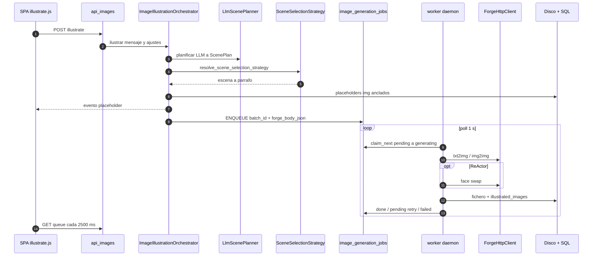

| Estrategia | Criterio de anclaje |
|---|---|
| `DistributedSceneSelectionStrategy` | Reparto uniforme entre párrafos. |
| `LlmEroticStorySceneSelectionStrategy` | El LLM elige párrafos narrativamente relevantes. |
| `LlmPornographicPeaksSceneSelectionStrategy` | El LLM localiza picos de intensidad. |

`scene_selection.py` combina **Strategy + Registry** (`_REGISTRY` + `resolve_scene_selection_strategy`). Añadir un criterio no toca el orquestador.

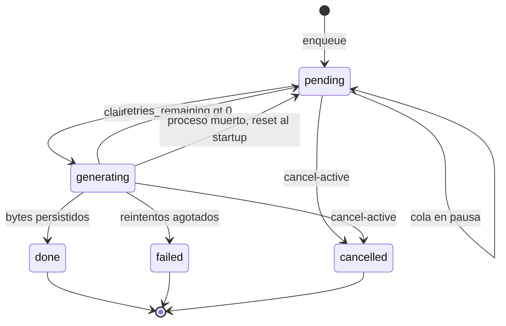

`POST /api/image-generation-queue/pause` libera la GPU para inferencia de texto sin descartar la cola.

### 5.5 Árbol y *forks*

`conversation_tree.py` agrupa por `parent_id` y resuelve el camino raíz → `active_leaf_message_id`. Un *fork* crea una conversación nueva (`forked_from_conversation_id`, `forked_from_message_id`) cuyo historial inicial es ese camino.

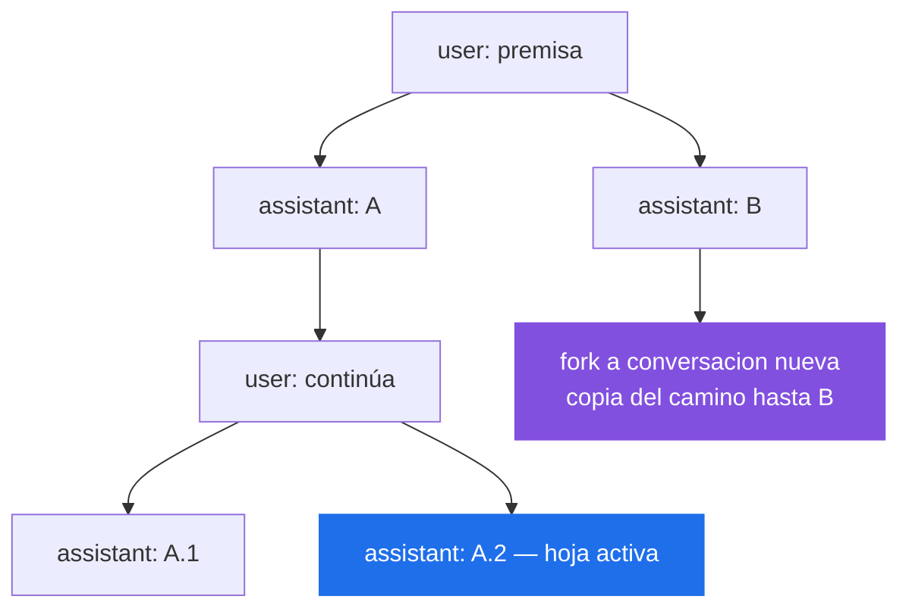

---

## 6. Consistencia y concurrencia

El proceso admite **tres escritores concurrentes** sobre SQLite: el request de chat (stream largo), la UI (CRUD, cola) y el worker de imágenes.

| Mecanismo | Valor | Motivo |
|---|---|---|
| `journal_mode` | `WAL` | Lecturas no bloquean escrituras. |
| `busy_timeout` | 30 000 ms | El stream NDJSON y el worker no fallan al primer lock. |
| `check_same_thread` | `False` | El worker usa `SessionLocal` en otro hilo. |
| `claim_next_image_generation_job` | update atómico de estado | Un solo worker; el claim es la frontera de exclusión. |
| Soft-delete | `conversations.deleted_at` | La papelera es reversible; la purga coordina SQL + Chroma + disco. |

**Fronteras de consistencia**

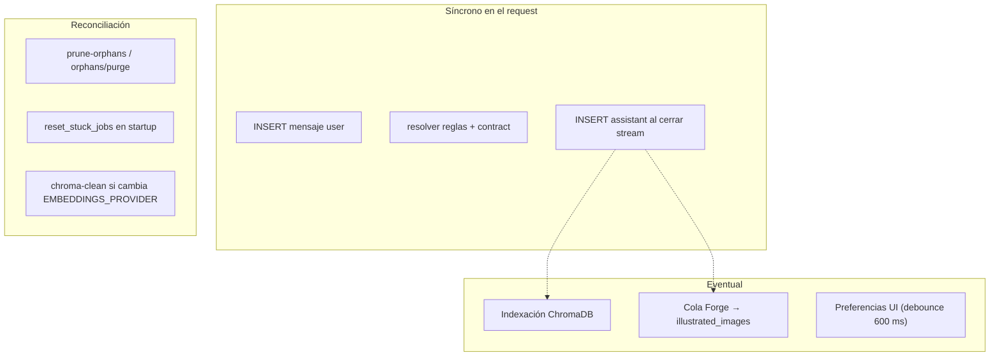

Chroma y el disco **no** participan en la transacción SQL. El sistema expone operaciones de reconciliación en lugar de fingir un commit distribuido. Si se cambia `EMBEDDINGS_PROVIDER`, las dimensiones de vector no son compatibles: hay que `make chroma-clean` y reindexar.

---

## 7. Modelo de seguridad

Diseñado para estación local multi-usuario, no para Internet público. Aun así, el perímetro interno es explícito.

| Control | Implementación |
|---|---|
| **Secretos** | `.env` fuera de git; `pydantic-settings`; sync unidireccional `os.environ → .env` de claves conocidas. |
| **Contraseñas** | PBKDF2-HMAC-SHA256, 260 000 iteraciones, salt de 16 bytes; comparación `hmac.compare_digest`. |
| **Sesión** | Token `secrets.token_urlsafe(32)` en cookie `chatbot_session`: `HttpOnly`, `SameSite=Lax`, 30 días. |
| **Autorización** | `CurrentUser` / `AdminUser` como dependencias FastAPI. |
| **Ownership** | `ownership.py`. Recurso ajeno → **404**, no 403: no se enumera el espacio de otro usuario. |
| **Catálogo** | Reglas builtin (`user_id IS NULL` + IDs fijos) son de solo lectura; 403 si se intenta mutar. |
| **Legado pre-multiuser** | Filas con `user_id NULL` solo las ve/edita un admin. |
| **Cliente** | Todas las peticiones van con `credentials: "include"`. |

Los proveedores remotos se **descubren**, no se listan a ciegas: `list_available_providers()` solo expone OpenAI/Mancer/Abliteration/NaN si existe la credencial correspondiente. Ollama está siempre presente.

---

## 8. Modelo de datos

PKs `CHAR(36)` UUID. FKs con `ON DELETE CASCADE` en cascadas de ownership; `messages.parent_id` es `ON DELETE SET NULL` para no destruir subárboles al borrar un ancla.

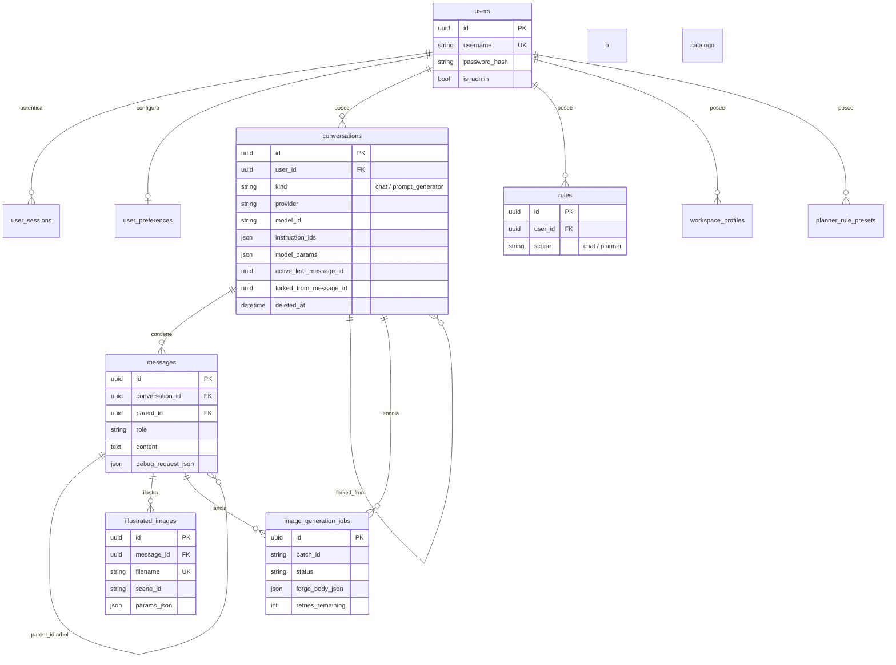

### Almacenamiento fuera de SQL

| Dato | Sitio | Por qué no está en SQLite |
|---|---|---|
| Vectores | ChromaDB `chat_history` · `./data/chroma` | Similitud; dimensión ligada al embedding. |
| Fichas de modelo | `data/model_info.json` clave `provider:model_id` | Metadatos editables sin migración. |
| Imágenes | Disco, `GET /api/illustrated-images/{filename}` | Binarios. |
| Overlays / presets | `config/*.json` | Versionados y revisables en PR. |
| Last Forge payload | Filesystem (`LastPayloadSource`) | Replay img2img sin rehidratar la API de Forge. |

---

## 9. Superficie HTTP

OpenAPI en `/docs` y `/openapi.json`. Título interno: `Chat IA con Ollama` `v1.0.0`.

| Router | Prefijo | Responsabilidad |
|---|---|---|
| `api_auth` | `/api/auth` | Registro, login, logout, `me`, password, preferencias. |
| `api_conversations` | `/api` | CRUD, papelera, *forks*, mensajes síncronos y NDJSON. |
| `api_message_tree` | `/api/message-tree` | Raíces e hijos paginados (vista global del bosque). |
| `api_models` | `/api` | Proveedores, modelos, presets, capabilities, contrato, fichas. |
| `api_rules` | `/api/rules` | Biblioteca por *scope*. |
| `api_images` | `/api` | Ilustración NDJSON, galería + facetas, cola, huérfanos, ReActor. |
| `api_prompt_generator` | `/api` | Turno del agente entrevistador → prompt txt2img. |
| `api_workspace_profiles` | `/api/workspace-profiles` | Snapshots del rig. |
| `api_planner_rule_presets` | `/api/planner-rule-presets` | Presets de reglas del planner. |
| `api_ollama` | `/api/ollama` | `clear-memory` (unload de VRAM). |

### Contratos destacados

| Método | Ruta | Semántica |
|---|---|---|
| `POST` | `/api/conversations/{id}/messages/stream` | Chat NDJSON. |
| `POST` | `/api/conversations/{id}/fork` | Conversación derivada desde un mensaje ancla. |
| `GET` | `/api/providers/{name}/models/{model_id}/contract` | `ModelContract` resuelto — lo que consume la UI. |
| `POST` | `/api/conversations/{id}/messages/{id}/illustrate` | Plan + enqueue; eventos `placeholder`, `image`, `log`. |
| `POST` | `/api/conversations/{id}/illustrations/generate-remaining` | Reintenta pendientes **sin** replanificar. |
| `GET` | `/api/illustrated-images/facets` | Dimensiones de filtro de la galería. |
| `DELETE` | `/api/conversations/deleted` | Purga de papelera + Chroma. |

---

## 10. Estrategia de testing

La suite por defecto **no habla con Ollama**. SQLite `:memory:` + dobles de `LLMProvider` / `ForgeGenerationPort`. Solo `tests/test_e2e_api.py` (`pytest -m e2e`) golpea el exterior.

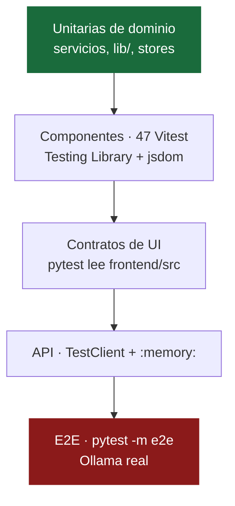

Los **contratos de UI** son deliberados: suites Python (`test_*_ui.py`, `test_react_frontend.py`, `test_spa_publicado.py`) leen el fuente vía `tests/frontend_source.py` y asertan IDs del shell, CSS e invariantes de markup. Evitan que una isla React rompa el chrome contra el que el resto del sistema está acoplado.

| Comando | Alcance |
|---|---|
| `make test` | `pytest -m "not e2e"` + cobertura `app` + Vitest si hay `node_modules` |
| `make test-e2e` | Solo `e2e` |
| `make frontend-test` | Vitest |
| `make coverage-html` | `htmlcov/` |
| `make mutation-test` | `mutmut` sobre `app/` |

Ante un bug: primero el test que falla, después el arreglo. No al revés.

---

## 11. Frontend

**Shell + islas.** `App.jsx` posee el chrome con IDs estables (los mismos que asertan los contratos Python). El contenido dinámico son islas React independientes. El estado no vive en Context ni en Redux: cada agregado tiene un *store* observable (`createStore`) y las islas se suscriben con `useSyncExternalStore` + selector.

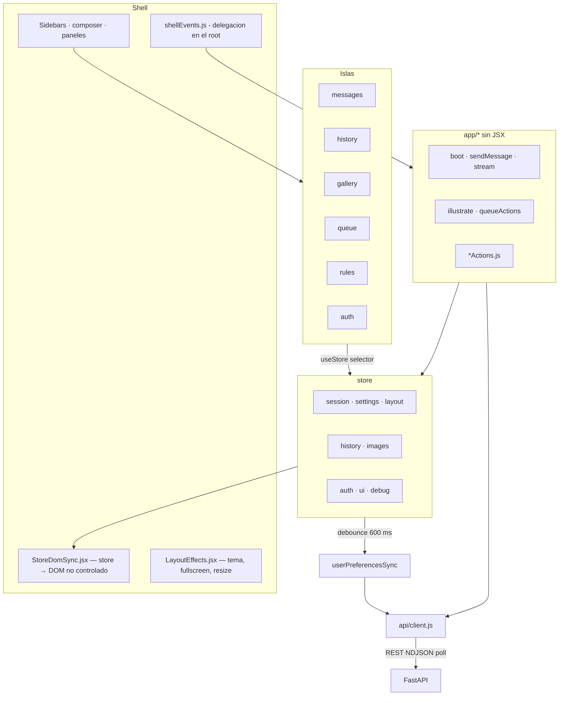

| Capa | Ruta | Rol |
|---|---|---|
| HTTP | `src/api/` | `fetchJson` + `ApiError`; un módulo por agregado. |
| Casos de uso | `src/app/` | Orquestación sin JSX. `ports.js` es fachada de nombres heredados. |
| Estado | `src/store/` | Un store por agregado; servidor como fuente de verdad post-login. |
| Puente | `src/hooks/useStore.js` | Selector granular. |
| Puro | `src/lib/` | Árbol, ventana, markdown, sanitizado, contrato de UI. |

Vite emite a `../app/static` con nombres fijos (`js/main.js`, `css/style.css`) y `base` condicional (`/` en dev, `/static/` en build). FastAPI sirve la SPA desde `/` **sin Node en runtime**. En desarrollo, Vite proxya `/api` a `127.0.0.1:8000` y reescribe `/static/*` al origen del HMR.

| Modo | Frontend | Backend | URL |
|---|---|---|---|
| `make up` | estático en `app/static` | Uvicorn `:8000` | `http://localhost:8000` |
| `make up-dev` | Vite HMR `:5173` | `run.py --reload` | `http://localhost:5173` |

---

## 12. Puesta en marcha

### Requisitos

| Componente | Versión | Obligatorio |
|---|---|---|
| Python | 3.12 (3.10+ funciona; Chroma rompe en 3.14 → usar `.venv312`) | Sí |
| [Ollama](https://ollama.com) | en marcha, con un modelo | Sí para inferencia local |
| Node.js + npm | 20+ | Solo para desarrollar o recompilar la SPA |
| Docker Compose | cualquiera | Solo RAG |
| [Forge Neo / A1111](https://github.com/lllyasviel/stable-diffusion-webui-forge) | API activa | Solo ilustración |

```bash
ollama pull llama3.2
ollama pull mxbai-embed-large
```

### Instalación

```bash
git clone git@github.com:pcgarat/chatBot.git && cd chatBot
cp .env.example .env

make up          # venv + deps + API sirviendo la SPA publicada
# → http://localhost:8000

make up-dev      # API --reload + Vite HMR (verbose)
# → http://localhost:5173   /api → :8000
```

`Ctrl+C` en `up-dev` detiene ambos procesos (`scripts/dev_stack.sh`).

### RAG

Sin Chroma la aplicación es funcional; solo desaparece la recuperación por similitud.

```bash
make chroma-up      # :8001, persistencia en ./data/chroma
make chroma-ping
make chroma-down    # conserva datos
make chroma-clean   # borra vectores
```

---

## 13. Configuración

`.env` (plantilla comentada en `.env.example`) → `app/config.py` (`pydantic-settings`). `sync_env_to_dotenv()` materializa en disco las claves presentes en el entorno y ausentes del fichero, para que un arranque con `OPENAI_API_KEY=… uvicorn` deje el proceso reproducible.

### Núcleo

| Variable | Defecto | Rol |
|---|---|---|
| `PYTHON_VERSION` | `3.12` | Intérprete de `make setup`. |
| `OLLAMA_HOST` | `http://localhost:11434` | Runtime local. |
| `DATABASE_URL` | `sqlite:///./chatbot.db` | SQLAlchemy. |
| `OLLAMA_HISTORY_TURNS` | `10` | Pares user+assistant de contexto. |
| `DEFAULT_LLM_PROVIDER` | `ollama` | `ollama` \| `mancer` \| `openai` \| `abliteration` \| `nan`. |

### RAG

| Variable | Defecto | Rol |
|---|---|---|
| `CHROMA_HOST` | `http://localhost:8001` | Endpoint del contenedor. |
| `EMBEDDINGS_PROVIDER` | `ollama` | `ollama` \| `openai`. |
| `OLLAMA_EMBEDDING_MODEL` | `mxbai-embed-large:latest` | Embedding local. |

### Proveedores remotos

| Variable | Efecto |
|---|---|
| `OPENAI_API_KEY`, `OPENAI_BASE_URL` | Habilita OpenAI. |
| `OPENAI_ORGANIZATION_ID`, `OPENAI_PROJECT_ID` | Atribución de uso. |
| `MANCER_API_KEY` | Habilita Mancer. |
| `ABLIT_KEY`, `ABLIT_BASE_URL` | Habilita Abliteration. |
| `NAN_API_KEY`, `NAN_BASE_URL` | Habilita NaN Builders (`nan`). |

### Forge / ReActor

| Variable | Defecto | Rol |
|---|---|---|
| `FORGE_BASE_URL` | `http://127.0.0.1:7860` | API A1111. |
| `FORGE_DATA_PATH` | — | Last generation. |
| `FORGE_STYLE_INIT_DIR` | — | Refs img2img con prioridad. |
| `FORGE_TIMEOUT_SECONDS` | `600` | Techo por job. |
| `FORGE_REACTOR_*` | ver `.env.example` | ~20 knobs: InsightFace, índices, upscaler, CodeFormer/GFPGAN, género, dispositivo, máscara. |

`GET /api/forge/reactor-defaults` proyecta esas variables a la UI. El panel no nace vacío.

---

## 14. Operación

`make help` es la interfaz. Variables: `PORT` (8000), `VITE_PORT` (5173), `VERBOSE`, `FILE`, `MODEL`, `WRITE`.

| Comando | Efecto |
|---|---|
| **Ciclo de vida** | |
| `make setup` | Sync `.env`, venv, requirements, `npm install`. |
| `make up` / `up-dev` | Producción local / HMR dual. |
| `make start` / `stop` | Solo API / API+Vite. |
| `make down` / `reload` / `status` / `clean` | Teardown, reinicio, diagnóstico. |
| **Calidad** | |
| `make test` / `test-e2e` / `frontend-test` | Suites. |
| `make coverage-html` | Informe. |
| `make mutation-test` / `mutation-report` | Mutmut. |
| **Chroma** | |
| `make chroma-{up,down,clean,ping,logs,status}` | Contenedor. |
| `make ingest FILE=…` / `clean-chroma` | Ingesta / reconciliación. |
| **Overlays** | |
| `make overlay MODEL=qwen3:8b` | Dry-run + propuesta. |
| `make overlay MODEL=qwen3:8b WRITE=1` | Persiste stub aditivo. |
| `make overlay PROVIDER=nan MODEL=gemma4` | Stub desde el catálogo de NaN. |
| `make overlay-batch` | Modelos sin overlay. |

---

## 15. Patrones de diseño

| Patrón | Dónde | Qué evita |
|---|---|---|
| **Hexagonal** | `image_illustration/ports.py`, `providers/base.py`, repositorios | Dominio acoplado a HTTP/SQL/Forge. |
| **Strategy + Registry** | `SceneSelectionStrategy`, `_REGISTRY` | `if/elif` en el orquestador. |
| **Factory + singleton por tipo** | `ProviderFactory`, `parse_model_id()` | Un cliente HTTP por proveedor. |
| **Repository** | `SqlAlchemyWorkspaceProfileRepository`, … | Casos de uso contra dobles en memoria. |
| **Null Object** | `empty_model_contract` | `if contract is None`. |
| **Producer–Consumer** | `worker.py` + `job_processor.py` | Generación dentro del request HTTP. |
| **Orchestrator** | `ImageIllustrationOrchestrator` | Plan, anclaje y enqueue en un solo módulo. |
| **Facade** | `frontend/src/app/ports.js` | Rotura de nombres durante la migración a stores. |
| **Observer** | `createStore` + `useSyncExternalStore` | Re-render global. |
| **Template Method (seed)** | `rules/seed.py` | Drift de builtins entre entornos. |
| **Soft-delete** | `deleted_at` | Pérdida irreversible por misclick. |

---

## 16. Convenciones

- **Ramas.** `feat/<descripcion-corta>` o `fix/<descripcion-corta>` desde `main` actualizado.
- **Commits.** [Conventional Commits](https://www.conventionalcommits.org/), cuerpo en español.
- **Tests primero** ante un defecto; cobertura en cada capacidad nueva; `make test` verde antes de PR.
- **Dependencias.** `routers → services → ports ← adapters`. Sin excepciones por conveniencia.
- **Comentarios.** Solo si el código no puede expresar la restricción.
- **Docs de trabajo.** En `docs/`, con fecha en el nombre del fichero.
)
